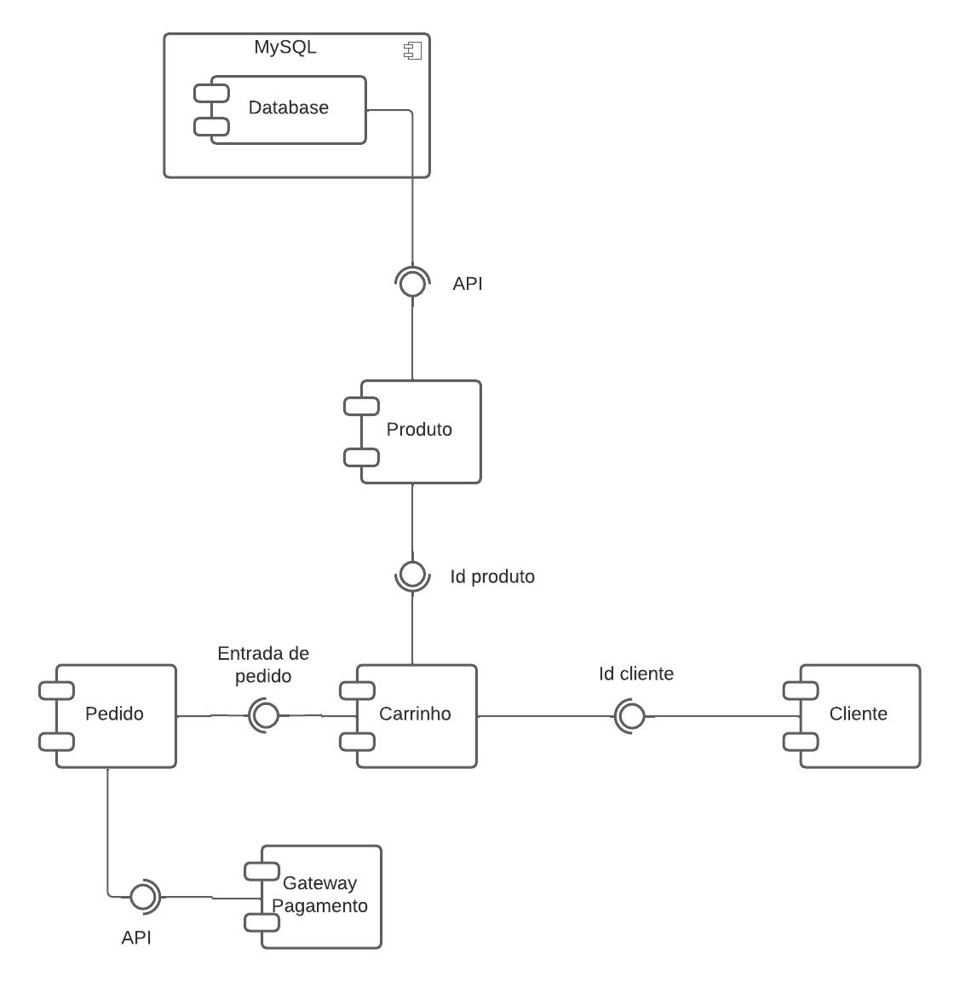

<h1> Beauty Face 2.0 </h1>

## Sobre o projeto

Este projeto consiste em uma nova versão do projeto BeautyFace, desenvolvido na disciplina Programação para Web, que agora conta com aprimoramentos e funcionalidades que visam tornar a experiência do usuário ainda mais satisfatória. Trata-se de um e-commerce dedicado à venda de produtos cosméticos, atendendo às necessidades de um público que busca cuidar da pele, do cabelo e da beleza de maneira eficaz e conveniente.

---

### Modelo lógico do banco de dados


---

### Diagrama de componentes



---

### Acesse a documentação da API [aqui](https://app.swaggerhub.com/apis-docs/JONATHANFERNANDEZ/ProjectWeb/0.1#/)

---

### 🎲 Rodando o projeto

- Para rodar o projeto é necessário:

  - Ter o MySQL instalado no PC (XAMPP, MySQL Workbench, etc.);
  - Após a instalação do MySQL, utilize o arquivo `script.sql`, localizado no diretório `documents`, para criar o banco de dados e suas tabelas.
    <br/>

- **Clone este repositório:**
  ```shell
  git clone https://github.com/johnoliveira06/BeautyFace2.0.git
  ```
- **Acesse o diretório do projeto:**
  ```shell
  cd BeautyFace2.0
  ```
- **Instale as dependências (diretórios frontend e backend):**

  ```shell
  cd frontend
  npm install
  ou
  yarn install
  ```

  ```shell
  cd backend
  npm install
  ou
  yarn install
  ```

- **Modifique o arquivo `index.js`, localizado no diretório `backend`, com as suas credenciais do MySQL:**
  ```Javascript
  const db = mysql.createConnection({
  host: "",
  user: "",
  password: "",
  database: "",
  });
  console.log("Conectado ao BD!");
  ```
- **Crie um arquivo `.env` no diretório `frontend` para armazenar suas chaves de API do Firebase (Necessário para realizar login com o Google):**

  ```shell
  # Evite modificar os nomes das variáveis, pois isso pode resultar em erros.

  VITE_FIREBASE_API_KEY = ""
  VITE_FIREBASE_AUTH_DOMAIN = ""
  VITE_FIREBASE_PROJECT_ID = ""
  VITE_FIREBASE_STORAGE_BUCKET = ""
  VITE_FIREBASE_MESSAGING_SENDER = ""
  VITE_FIREBASE_APP_ID = ""
  VITE_FIREBASE_MEASUREMENT_ID = ""
  ```

- **Crie um arquivo `.env` no diretório `backend` para armazenar suas chaves de API do Mercado Pago (Necessário para realizar pagamentos):**

  ```shell
  # Evite modificar os nomes das variáveis, pois isso pode resultar em erros.

  MERCADO_PAGO_ACCESS_TOKEN = ""
  ```

- **Inicie o backend:**
  ```shell
  npm start
  ou
  yarn start
  ```
- **Inicie o frontend:**
  ```shell
  npm run dev
  ou
  yarn run dev
  ```

---

Feito por [Jonathan Oliveira](https://github.com/johnoliveira06) 😊
